# Analyzing Data with Spark
**M2 Artificial Intelligence | Université Grenoble Alpes**

**Authors:** Lena Pickartz & Masa Cucic   
**Course:**  Large Scale Data Management  
**Date:** January 2026  

This report analyzes a 29-day trace of 12,500 machines. We used Apache Spark to process this data and understand how Google manages resources in a large-scale Cloud environment. For this analysis, we chose to work with Spark DataFrames.

---
## 1. What is the distribution of the machines according to their CPU capacity? Can you explain (motivate) it?
**Analysis:** We analyzed the df_machines table by filtering for distinct CPU capacities at the start of the trace (timestamp 0). At this time, 12,477 machines were active. Since capacities are normalized relative to the largest machine (1.0), we grouped the data by CPU value and calculated the percentage for each class.

**Result:** Our results show that the cluster is very uniform. Most machines (93%) are standardized at a 0.5 CPU capacity. The rest of the cluster consists of small groups with 1.0 CPU (6%) and 0.25 CPU (1%).

- 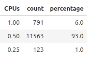          |             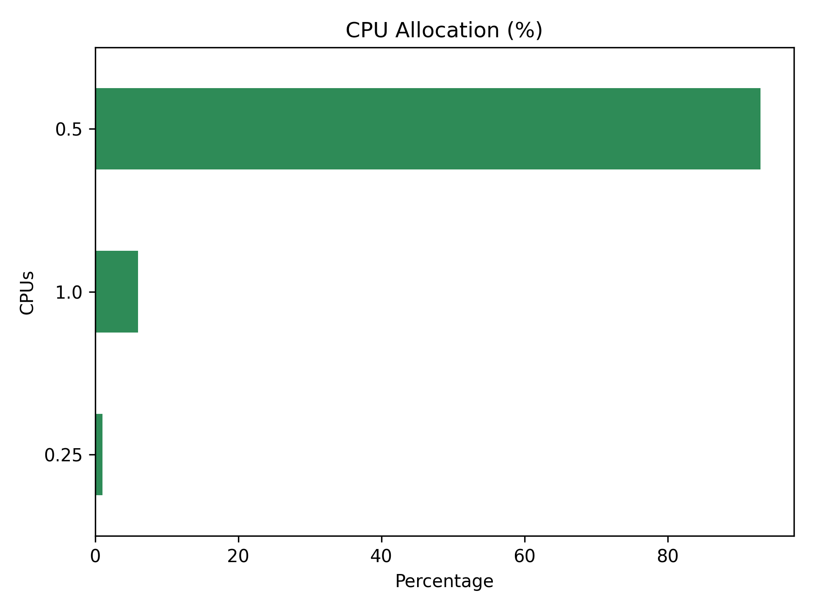

**Motivation/Conclusion:** One reason for the majority of CPUs being at 0.5 capacity could be that it is easier to maintain the machines if they all have a similar hardware meaning a similar CPU, e.g. to have fewer types of spare CPU in stock. Having a "standard" CPU will also reduces the complexity of scheduling jobs and tasks, as the machines are fairly homogenous and tasks can be scheduled without much computation.

## 2. What is the percentage of computational power lost due to maintenance (a machine went offline and reconnected later)? The computational power is proportional to both the CPU capacity and the unavailability period of machines.
**Analysis:** To calculate the lost power, we identified periods where machines were offline by pairing "remove" events (type 1) with their subsequent "add" events (type 0). Since the data does not clearly distinguish between a hardware failure and scheduled maintenance, we treated all such "offline" periods as maintenance events. We analyzed the df_machines table using Spark Window functions, partitioning by machine_id and ordereding by time. This allowed us to pair every "remove" event (type 1) with its corresponding "add" event (type 0) for the same physical machine. We identified the number of machine reloads (from "remove" event to "add" event) and found that our count matches the findings in the research paper "Characterizing Machines and Workloads on a Google Cluster" (page 3), which confirms our logic is correct. Then, for every machine's offline period, we multiplied the CPU capacity by the duration of the downtime, to get the lost resources. We then compared the sum of all these lost resources against the total possible power of the cluster over the 29-day period. 

**Result**: Across the entire cluster, the total percentage of computational power lost due to maintenance is 1.8879%. 

**Conclusion:** This result shows that less than 2% of total potential processing power os lost due to maintenance. This is very good having in mind there are 12500 machines in the cluster. 

## 3. Is there a class of machines, according to their CPU, that stands out with a higher maintenance rate, as compared to other classes ?
**Analysis:** Here, by maintenance rate, we observe how frequently machines undergo maintenance (or else: offline periods). We want to see if there is a class of machines (grouped by their CPU capacity) that experiences longer or more frequent maintenance periods compared to others. For each machine, we calculate maintenance rate as a total_offline_time per machine divided by that machine's total lifetime. We use already calculated df_reloaded table from previous task. Based on that, we calculate maintenance_rate as a sum of total offline time per machine divided by a sum of total lifetimes of all machines, per CPU group. 

**Result:** Machines with lowest CPU capacity (0.25) have the highest average maintenance rate (~3.25%). 

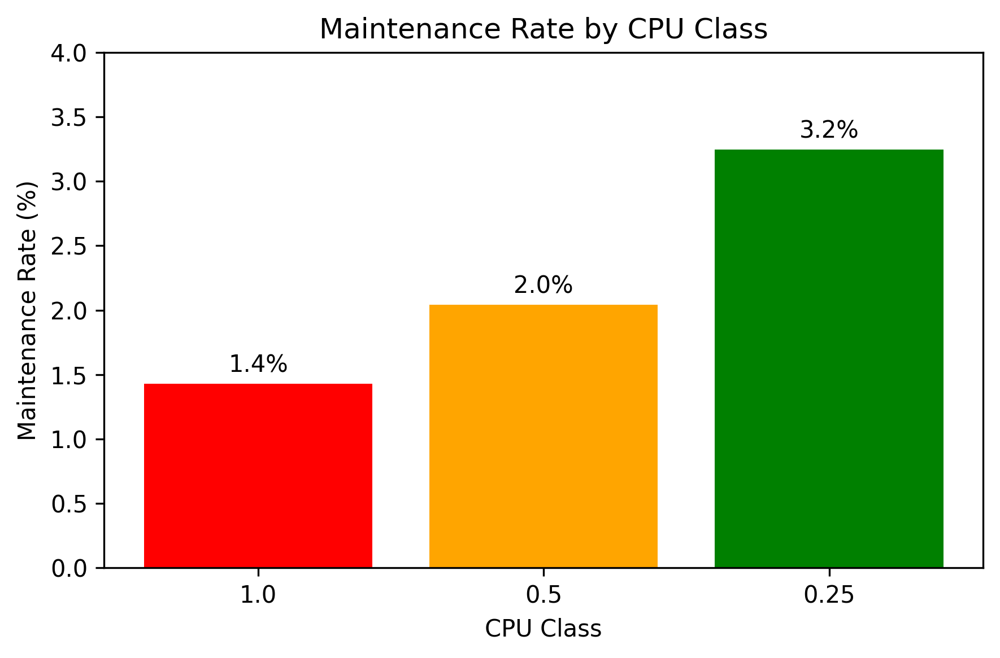

**Conclusion:** Lower-CPU machines tend to have higher downtimes (maintenance and failures), which means they either undergo maintenance more frequently or for longer periods.

## 4. What is the distribution of the number of jobs/tasks per scheduling class? Comment on the results.
**Analysis:** By loading the job events and task events tables the counts of the number of unique jobs and tasks per scheduling class is counted by grouping on the scheduling_class field and calculating percentages based on total counts from the task events table and job events table as a comparison. The further analysis is based on the task events table (df_task_events), which was chosen because it provides a complete view of all 9,642 jobs in the dataset, as opposed to the job events table which only contains 8,770 jobs due to missing records from data collection issues. The results from both analyses (task and jobs on task events table) are joined into a single dataframe to compare job and task distributions across all four scheduling classes. 

**Result:** As the documentation points out, class 0 define non-production workloads. Those make up the most jobs (33%) and the most tasks (86%). This also suggests that non-production jobs tend to have many task per jobs. In contrast, class 1 compromises 31% of all jobs but only 10% of tasks, indicating that those are smaller jobs. Class 2 shows a similar pattern with 26% for jobs and 3% for tasks. Finally, class 3, which - according to the documentation - represent the latency sensitive production workloads make up only 1% of all jobs as well as only 1% of all tasks. The results show that higher scheduling classes tend to have fewer tasks per job, while lower classes run larger parallel workloads.

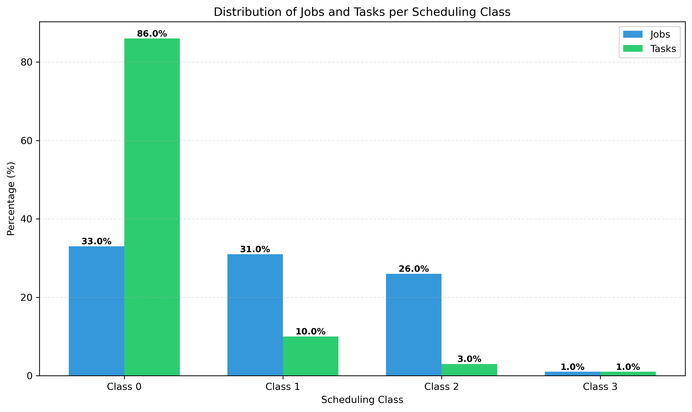

## 5. Would you qualify the percentage of jobs/tasks that got killed or evicted as important?
**Analysis:** The analysis filters the task events table for kill (event_type = 5) and eviction (event_type = 2) events, then counts the number of distinct jobs and tasks that experienced these events at least once by selecting unique combinations of job_id and task_index. Percentages are calculated by dividing these counts by the total number of jobs and tasks from the previous analysis (task 4), with separate calculations for kills and evictions to understand the breakdown. 

**Result:** 
Out of all jobs, 51% of them were killed or evicted, within these jobs 43% of all tasks were killed or evicted at least once. Especially because of these high numbers, the percentage of evictions and kills is highly important. Nearly half of all jobs and tasks experience termination. This is a substantial portion of the workload that doesn't complete successfully on the first attempt and can reflect system reliability indicators. The high numbers might reflect the scheduling strategy from Google, as the documentation notes: "it can happen that there are not enough resources to meet all the runtime requests from the tasks, even though each of them is using less than its limit. If this happens, one or more low priority task(s) may be killed." The high number of evictions (83,227 task evictions) demonstrates that lower-priority tasks, which also make up 36% of all jobs and 86% of all tasks, may act as a "buffer" for cluster capacity, being evicted when resources are needed for higher-priority tasks.

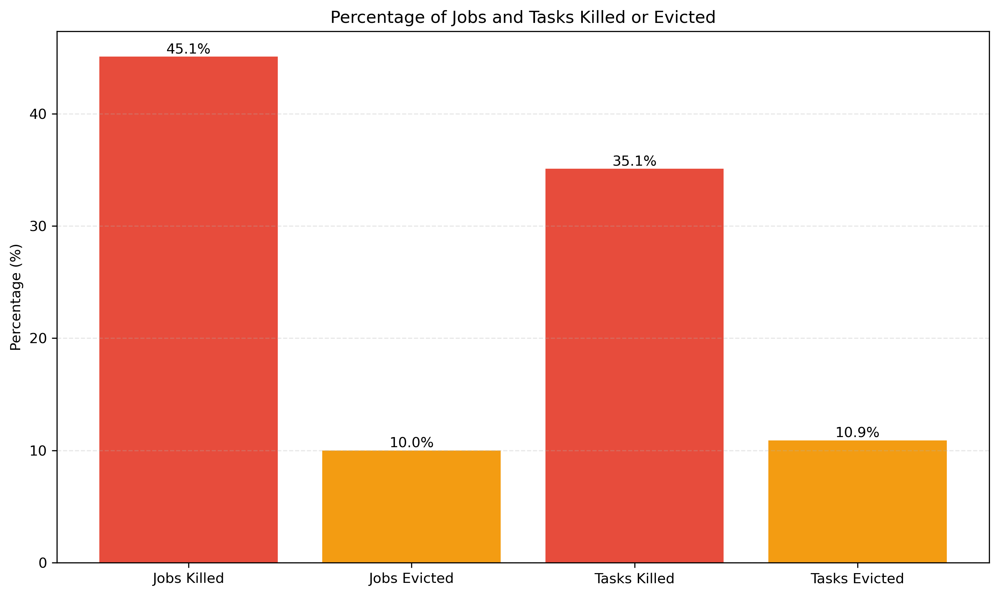

## 6. Do tasks with a low scheduling class have a higher probability of being evicted?
**Analysis:**
By filtering the task events table for eviction events (event_type = 2), selecting the task_index and scheduling_class columns, then grouping by scheduling class and counting the number of evicted tasks in each class the result is created. Percentages are calculated by dividing each scheduling class's eviction count by the total number of evictions to show the distribution of evictions across classes. 

**Result:**
The analysis of 83,227 task evictions show that tasks with a lower scheduling class are evicted more often than tasks with a higher scheduling class. Tasks from class 0 (non-production) make up 75% of all evictions, class 1 21%, class 2 4% and class 3 (most latency-sensitive tasks) only 1%.

As the documentation explicitly states "The cluster scheduler attempts to prevent latency-sensitive tasks at these priorities from being evicted due to over-allocation of machine resources"
This explains why class 0 tasks get evicted the most and why higher scheduling classes have some protection against eviction. The documentation states that EVICT events occur due to: "a higher priority task or job, because the scheduler overcommitted and the actual demand exceeded the machine capacity, because the machine on which it was running became unusable (e.g. taken offline for repairs), or because a disk holding the task's data was lost."

As already assumed in question 5, non-production workloads serve as a resource buffer and get sacrificed to enable the cluster to maintain responsiveness for production workloads. While Class 0 and 1 dominate evictions by volume, Classes 3-4 still experience eviction rates of 1% to 4%. This indicates that even higher scheduling classes can be evicted under certain conditions (machine failures, extreme resource pressure).

## 7. In general, do tasks from the same job run on the same machine? Comment on the observed locality strategy and its pros and cons.
**Analysis:**
After filtering the task events table for scheduled tasks (event_type = 1), they are grouped by job_id to count the number of unique tasks and unique machines for each job, calculating a tasks-per-machine ratio to understand placement patterns. Multi-task jobs are categorized into three groups: "fully_distributed" (tasks_per_machine = 1), "over_distributed" (tasks_per_machine < 1), and "multiple_tasks_per_machine" (tasks_per_machine > 1), with single-task jobs excluded from analysis since they cannot demonstrate locality patterns. The distribution across these categories is calculated by counting jobs in each category and computing percentages based on the total multi-task jobs.

**Result:**
Tasks from the same job generally do not run on the same machine. Google employs a distributed scheduling strategy where tasks are spread across different machines. The analysis based on 2,500 multi-task jobs shows that only 6% have multiple tasks sharing machines. Google seems to avoid placing tasks from the same job on the same machine. Nearly 74% of jobs have a 1:1 task-to-machine mapping, with each task running on a distinct machine. This is the dominant scheduling pattern. 20% are over-distributed meaning that these jobs used more machines than they had tasks.

One advantage of this high distribution scheduling system is, that a potential machine failure affects only one task per job for the majority of jobs. Scalability gets a lot easier with this scheduling as well, as no job is limited by any single machine's capacity. Distributing tasks across machines also prevents a single machine from becoming overloaded while others remain underutilized. One disadvantage is the high complexity and the communication and coordination demand for the scheduler.

## 8. Are the tasks that request the more resources the one that consume the more resources?
**Analysis:** We analyze task usage table and task events table, in order to compare required resources for each task (required cpu, ram, local disk from task events table) and the mean resources used (mean cpu usage, memory usage, local disk usage from task usage table). First, we normlaize the columns from task usage table that are not normalized, and are relevant for our analysis. Then, for each specific task and job, we calculate average mean resources, across different timeframes. Now, in order to calculate actual efficiency of used resources, we decide to calculate usage_efficiency as:  $$usage\_efficiency = \frac{actual\_usage}{requested\_amount}$$  And we calculate usage_efficiency for each of three different resources separately (cpus, ram, local disk).  Now, for all these 3 factors (cpu_efficiency, ram_efficiency and disk_efficiency), we want to see if there is any correlation between the efficiencies and their corresponding request for resource. So, we calculate correlation between cpu_efficiency and requested cpu, ram_efficiency and requested ram, disk efficiency and requested disk.
For all of them, we get correlation values close to zero, meaning that there is no linear correlation. However, the correlation coefficient might have missed some other types of relationships, so we plot these variables to check potential non-linear trends between eficiencies and requests.

**Result:** From the plots provided, we observe that the efficiency of resources requested is the highest when the requested resources are low, and the efficiency drops as the requested amount of resources grows. That means that tasks asking for the most resources are actually the most wasteful, as they rarely use the high amounts they were assigned.

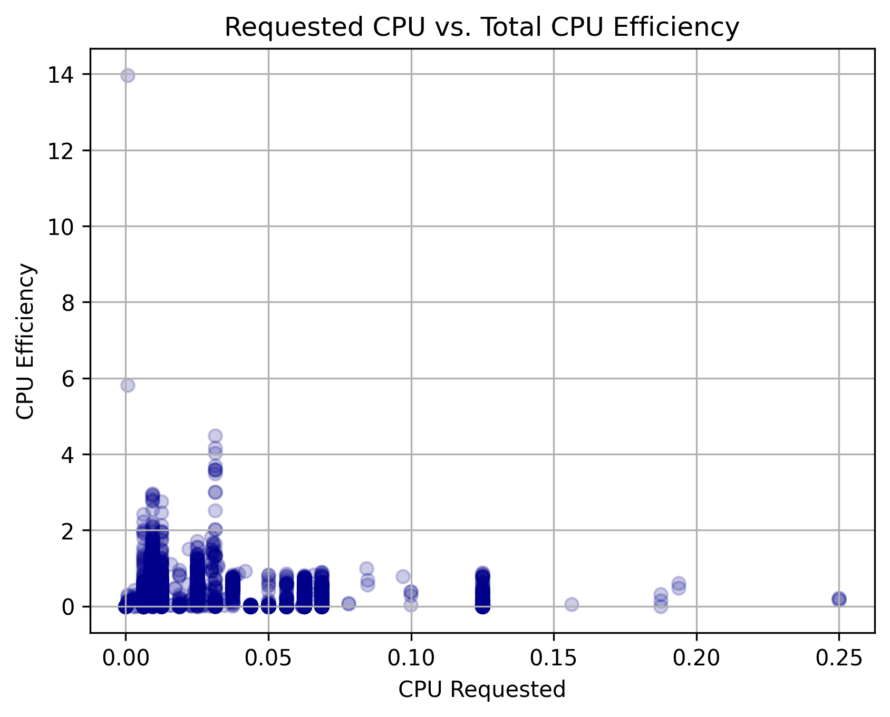 | 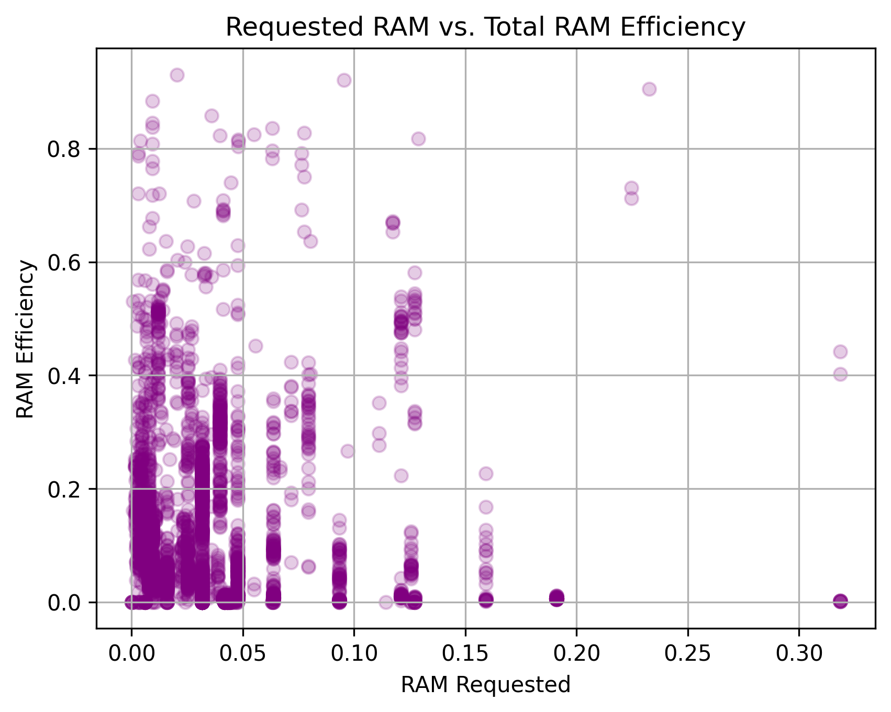 |  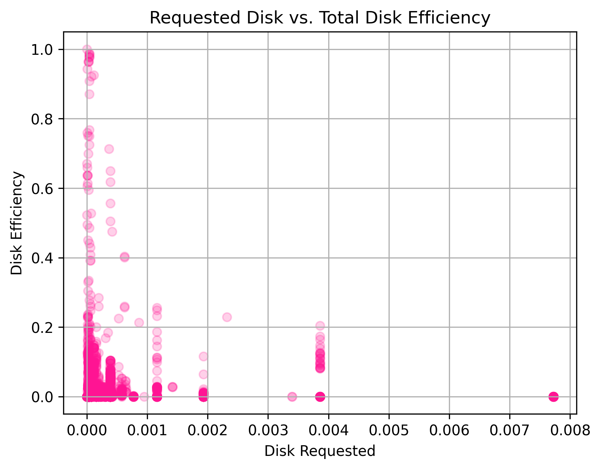 

## 9. Can we observe correlations between peaks of high resource consumption on some machines and task eviction events?
**Analysis:** We analyzed the task events and usage peaks to see if resource spikes cause evictions. First, we filtered the task events to identify only evictions (event type 2) and grouped them into 5-minute windows to count how many occurred per machine in each timeframe. We performed the same 5-minute window grouping on the task usage table to find the peaks of CPU and memory consumption. Finally, we joined these two tables by machine and window, allowing us to calculate the correlation between high resource peaks and the eviction count.

**Result:**  We get that there is almost no correlation between resource peaks and evictions, with values around -0.025 for CPU and -0.028 for RAM. That means that resource peaks are not the main reason for evictions. The scatter plots confirm this, as eviction events are spread out regardless of whether resource usage is low or high. This means that tasks aren't being kicked off just because a machine is "full" in a 5-minute window, but evictions are likely triggered by other factors, like higher-priority jobs arriving or specific scheduling policies. Also, visually, it looks like more evictions happen when usage is low, but this is simply because the vast majority of tasks in the cluster have low resource peaks. Because there are so many more "small" tasks, they naturally account for more of the eviction events.

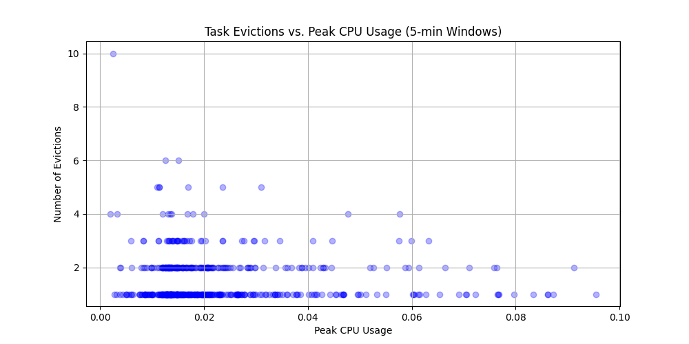 | 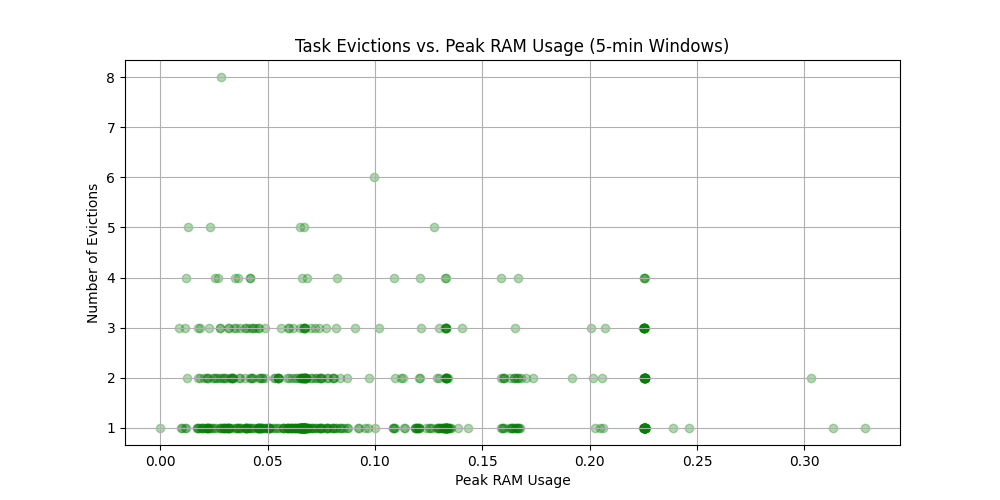

## 10. How often does it happen that the resources of a machine are over-committed2?
**Analysis:**
The analysis joins the task usage table with task events to obtain resource requests (CPU and RAM), then groups by measurement period and machine to sum total requested resources, and joins this with machine capacity data to get the most recent capacity for each machine at each time period using a window function. For each machine-period combination, it flags CPU and memory over-commitment by comparing total requested resources against machine capacity, creating binary indicators when requests exceed capacity. Finally, it counts the total number of measurements and the frequency of CPU over-commitment, memory over-commitment, both simultaneously, and any over-commitment, calculating percentages to quantify how often over-commitment occurs in the cluster.

**Result:**
Machine resources are overcommitted approximately 9.68% of the time. Specifically CPU is overcommitted 7.94% of the time and memory is overcommitted 8.43% of the time. Both of them are overcommitted at the same time in 6.69% of the time.

---
## 11. Original Question 1: What is the distribution of priority levels within scheduling class 3, and do higher priorities within this class correlate with lower eviction/kill rates?¶

**Motivation:**
While scheduling class classifys the tasks/jobs into e.g. production vs. non-production tasks/jobs, priority levels within the same class should theoretically influence resource allocation decisions and protection from disruption within these classes. By examining whether higher priorities correlate with lower eviction and kill rates specifically within Class 3, we can verify if the scheduler's priority mechanism effectively protects the critical production tasks.

**Analysis:**
The analysis first looks the overall priority distribution across all scheduling classes by grouping task events by both scheduling class and priority, creating a stacked bar chart to visualize how priorities are distributed, then filters specifically for scheduling class 3 to examine its priority composition. For each priority level in Class 3, it calculates total events, evictions, and kills, then computes eviction and kill rates as percentages to assess whether higher priorities experience lower disruption. 
**Result:**
In scheduling class 3 (latency-sensitive production tasks) priority 1 tasks dominate with 44%, followed by priority 9 at 30% and priority 0 at 14%. Priority 8 makes up 10%, while priorities 2 and 10 are minimal at 0.2% and 0.4%. This suggests that within the most latency-sensitive scheduling class, tasks still operate at varying priority levels, though most tasks (75%) are labelled priority 1 or 9.

Surprisingly, higher priorities do not consistently correlate with lower eviction and kill rates within scheduling class 3. The data reveals counterintuitive patterns. Priority 8 experiences the highest kill rate at 53%, despite being a relatively high priority level. This is unexpected and suggests that priority 8 tasks may be frequently killed for reasons unrelated to resource competition (such as user cancellation, job dependencies, or task failures). Priority 10, the highest priority level in this class, does show the lowest disruption rates, which aligns with expectations that the scheduler would protect the highest-priority tasks.

Eviction rates are more clearly correlated with priority than kill rates. Higher priorities (8, 9, 10) show near-zero eviction rates (0-3%), while lower priorities (0, 1) experience slightly higher eviction rates (14-17%). This suggests the scheduler is successfully protecting high-priority tasks from resource-based evictions. Kill rates do not follow this pattern, as kills are also triggered by factors beyond the scheduler's control (e.g. human actions).

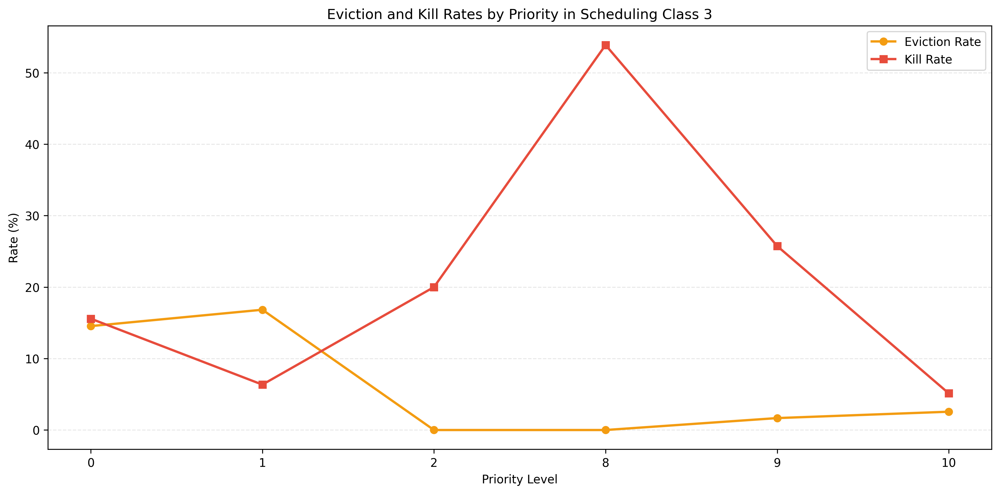

---
## 12. Original Question 2: Are high-priority tasks evenly distributed across all machines, or are they concentrated on a few specific machines?

**Analysis:** We analyzed task events table by filtering high-priority tasks (Priority 8+) , and observing how they are distributed across the cluster by counting the number of tasks executed per machine.

**Results:**
Our data shows that important tasks are packed together. A very small group of machines handles almost all the important work (about 12,000 tasks each). Meanwhile, thousands of other machines handle almost zero important tasks. We used log scale for visualization, because otherwise, the machines with only a few tasks would look like zero on the graph.

What this means for the cluster
- Grouping (Packing): Google’s system likes to put important tasks together. They probably pick their best and most reliable machines for this work.
- Efficiency: Keeping these tasks close together makes them run faster and saves space on other machines for different types of work.
- Risk: This is a bit risky. Since so many important tasks are on the same few machines, if one of those machines breaks, a lot of important work stops at the same time.

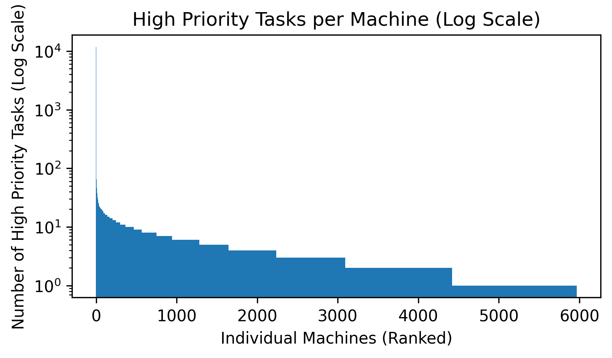

**Conclusion:**
Google uses a **packing strategy**. They likely group important tasks on their most reliable hardware to improve efficiency, even if it increases the risk of "hotspots."

------------------------

# Extending the Work: Studying Other Datasets
The [Alibaba cluster trace from 2017](https://github.com/alibaba/clusterdata/tree/master/cluster-trace-v2017) provides information about a datacenter over a 24-hour period, capturing both batch jobs and online services across 1,313 machines. 

Each machine’s capacity is recorded in terms of CPU cores, memory, and disk, and utilization is measured every minute and averaged over 5 minutes, capturing actual resource usage including operating system overhead. The trace also includes task-level information for batch workloads, such as start and end times, requested resources, and machine assignments, as well as events for online service instances. 

The CPU capacity distribution (question 1) of the servers in this dataset is extremely simple and homogeneous as all machines start with 64-core CPUs, and there are no other CPU sizes at cluster initialization, although 7 machines show more than one CPU value over time. Analysis of task placement (question 7) shows that Alibaba strongly favors anti-locality as almost all multi-task jobs are over-distributed, with 96% of jobs having their tasks spread across more machines than tasks, only 3% perfectly distributed (one task per machine), and just 1% showing multiple tasks colocated on the same machine. This contrasts sharply with the Google cluster, where the dominant pattern was fully distributed jobs (74% of multi-task jobs with one task per machine). Machine over-commitment analysis (question 10) reveals that the cluster operates at extremely high utilization because 99.67% of measurements exceed CPU capacity, all exceed memory capacity, and nearly all measurements exceed at least one resource, with both CPU and memory simultaneously overcommitted in 99.67% of cases. This reflects an intense resource allocation strategy. In comparison, the Google cluster shows a management approach with minimal contention. Overall, the Alibaba trace highlights the cluster’s high efficiency and aggressive anti-locality scheduling, providing a stark contrast to Google’s more locality-aware approach to resource management.

# Sources
Additional Sources used for solving the tasks

## Dataset related
- [Bashir, N., Deng, N., Rzadca, K., Irwin, D., Kodak, S., & Jnagal, R. (2021, April). Take it to the limit: peak prediction-driven resource overcommitment in datacenters. In Proceedings of the Sixteenth European Conference on Computer Systems (pp. 556-573).](https://research.google/pubs/take-it-to-the-limit-peak-prediction-driven-resource-overcommitment-in-datacenters/) 
- [Chen, X., Lu, C. D., & Pattabiraman, K. (2014, November). Failure analysis of jobs in compute clouds: A google cluster case study. In 2014 IEEE 25th International Symposium on Software Reliability Engineering (pp. 167-177). IEEE.](https://blogs.ubc.ca/karthik/files/2014/09/ISSRE2014.pdf) 
- [Liu, Z., & Cho, S. (2012, September). Characterizing machines and workloads on a Google cluster. In 2012 41st International Conference on Parallel Processing Workshops (pp. 397-403). IEEE.](https://www.xcg.cs.pitt.edu/papers/liu-srmpds12.pdf)

## Spark Related
- [PySpark Where Filter Example](https://sparkbyexamples.com/pyspark/pyspark-where-filter/)
- [PySpark GroubBy Example](https://sparkbyexamples.com/pyspark/pyspark-groupby-count-explained/)
- [PySpark GroubBy Percentage Example](https://www.statology.org/pyspark-groupby-percentage/)
- [Pyspark Documentation SQL lit](https://spark.apache.org/docs/latest/api/python/reference/pyspark.sql/api/pyspark.sql.functions.lit.html)
- [PySpark Window](https://spark.apache.org/docs/latest/api/python/reference/pyspark.sql/api/pyspark.sql.Window.html)

