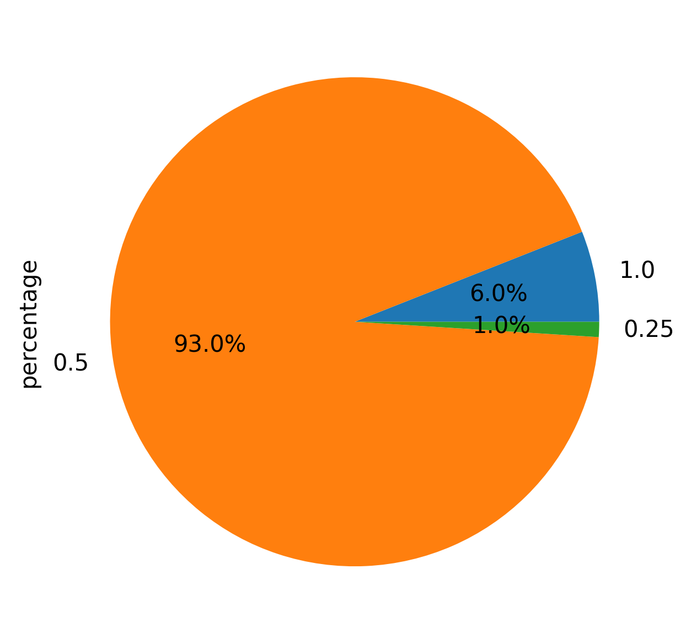

# Analyzing Data with Spark
Master M2 – Université Grenoble Alpes
2025
Lena
Masa

This project analyzes a massive dataset provided by Google, which tracks the activity of a cluster containing 12,500 machines over a 29-day period. The goal is to use Apache Spark to process this large-scale data and understand how computing resources are managed in a real-world Cloud environment.

---
## 1. What is the distribution of the machines according to their CPU capacity? Can you explain (motivate) it?
* **Analysis:** We analyzed the df_machines table by looking at the distinct CPU capacities recorded at the start of the trace (timestamp 0). There were 12,477 machines active at this time. The CPU capacities are normalized, meaning they are scaled relative to the largest machine in the cluster (represented as 1.0). Our results show that the cluster is highly uniform:
- 0.5 CPUs: 93% of machines (The vast majority)
- 1.0 CPUs: 6% of machines
- 0.25 CPUs: 1% of machines
* **Motivation:** The dominance of the 0.5 CPU capacity suggests a strategy of homogeneity. Most machines are built with the same hardware to simplify cluster management.
* **Plot:** 
* **Conclusion**: The cluster is designed to be mostly uniform (homogenous). By using a "standard" 0.5 CPU machine for 93% of the cluster, Google reduces hardware complexity and makes the automated scheduling of tasks much simpler.

## 2. What is the percentage of computational power lost due to maintenance (a machine went offline and reconnected later)? [4pt]The computational power is proportional to both the CPU capacity and the unavailability period of machines.
* **Analysis:** To calculate the lost power, we looked for instances where a machine was removed and then reconnected later. Since the data does not clearly distinguish between a hardware failure and scheduled maintenance, we treated all such "offline" periods as maintenance events.

- Method: We used the lead() function in Spark, partitioned by machine_id and ordered by time. This allowed us to pair every "remove" event (type 1) with its corresponding "add" event (type 0) for the same physical machine.
- Validation: We identified the number of machine reloads and found that our count matches the findings in the research paper "Characterizing Machines and Workloads on a Google Cluster" (Figure 3), which confirms our logic is correct.
- Calculation: For every offline period, we multiplied the CPU capacity by the duration of the downtime. We then compared the sum of all these lost resources against the total possible power of the cluster over the 29-day period.

* **Result:**  Across the entire cluster for the full 29-day period, the total percentage of computational power lost due to maintenance and failures is 0.16%.
* **Conclusion:** A loss of only 0.16% is remarkably low. This shows that Google’s infrastructure is highly reliable and that machines are rarely offline for long. Even though thousands of machines are involved, the system manages to keep the "available" power very close to the "theoretical maximum," meaning maintenance has a very small impact on the cluster's overall performance.

## TODOOOOOO

## 3. Is there a class of machines, according to their CPU, that stands out with a higher maintenance rate, as compared to other classes ?
* **Analysis:** 
Here, by maintenance rate, we observe how frequently machines undergo maintenance (or else: offline periods). We want to see if there is a class of machines (grouped by their CPU capacity) that experiences longer or more frequent maintenance periods compared to others.

We calculate maintenance rate as a total_offline_time per machine divided by total_time (already calculated in previous task). We will use already calculated df_reloaded from previous task
* **Result:** From here, we conclude that machines with lowest CPU capacity (0.25) have the highest average maintenance rate (~1.92%)  
Therefore, the conclusion is that lower-CPU machines tend to have higher downtimes (maintenance and failures), which means they either undergo maintenance more frequently or for longer periods.

## 4. What is the distribution of the number of jobs/tasks per scheduling class? Comment on the results.
* **Comment:** [Which class is most common?]
* **Plot:** 

## 5. Would you qualify the percentage of jobs/tasks that got killed or evicted as important?
* **Percentage:** [Insert %]
* **Comment:** [Is this number high or low for a cluster?]

## 6. Do tasks with a low scheduling class have a higher probability of being evicted?
* **Observation:** [Do lower classes get kicked out more?]

## 7. In general, do tasks from the same job run on the same machine? Comment on the observed locality strategy and its pros and cons.
* **Observation:** [Do tasks from the same job stay together?]
* **Pros/Cons:** [Explain network speed vs. reliability]

## 8. Are the tasks that request the more resources the one that consume the more resources?
* **Finding:** [Do tasks use as much as they ask for?]

## 9. Can we observe correlations between peaks of high resource consumption on some machines and task eviction events?
* **Correlation:** [Do evictions happen when machines are full?]

## 10. How often does it happen that the resources of a machine are over-committed2?
* **Frequency:** [How often is the machine "too full"?]

---

## 11. Original Question 1: Are high-priority tasks evenly distributed across all machines, or are they concentrated on a few specific machines?

**Question:** Are high-priority tasks evenly spread across all machines, or are they concentrated on a few specific machines?

**Motivation:**
This question explores how the cluster handles risk. If important tasks are "packed" on a few machines, one hardware failure could be very dangerous.

**Results:**
Our analysis shows a **"long-tail" distribution**. A small group of machines handles almost all high-priority work (around 12,000 tasks each), while thousands of others handle nearly zero. We used a **log scale** for the plot to make the quiet machines visible.

**Conclusion:**
Google uses a **packing strategy**. They likely group important tasks on their most reliable hardware to improve efficiency, even if it increases the risk of "hotspots."

**Plot:** 

---

## 12. Original Question 2: ???
**Motivation:**
-----

**Results:**
[Insert your Spark results here]

**Conclusion:**
[Insert your conclusion here]